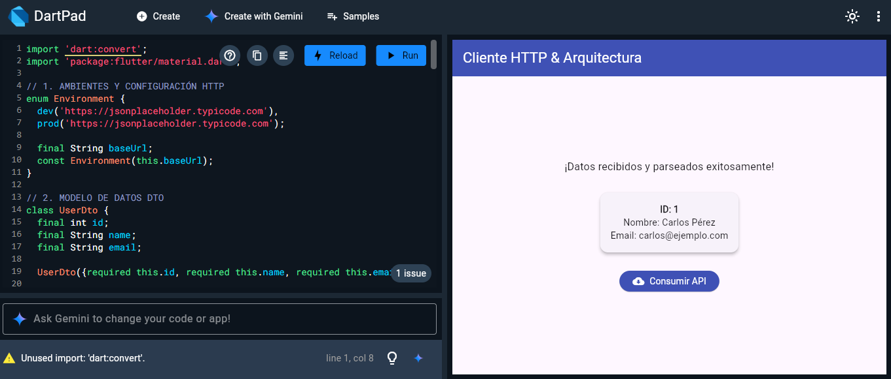
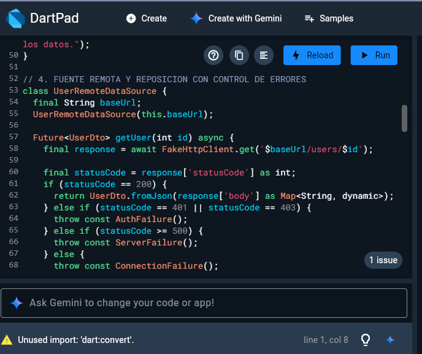
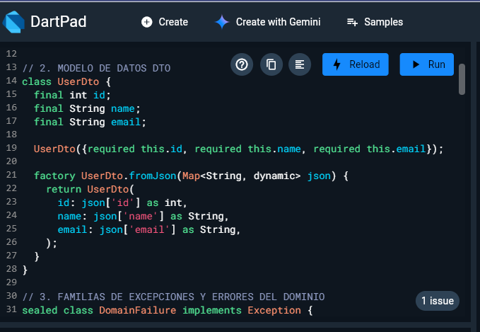
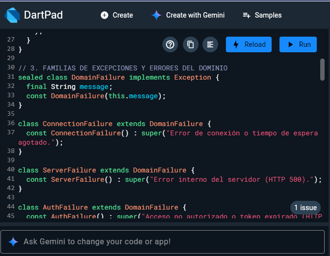
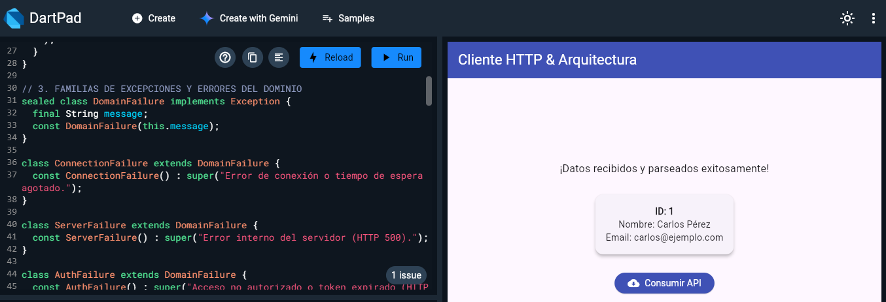

*DOCUMENTO TÉCNICO DE ARQUITECTURA HTTP Y RED*

*Asignatura:* Desarrollo Móvil Avanzado
*Estudiante:* Alex Dario Quilligana Ruiz 

Enlace al Repositorio: https://github.com/AleQr01/SEMANA-13_APLICACIONES-MOVILES

*1. Selección y Configuración del Cliente HTTP*
   
Justificación de la Elección
Se ha seleccionado Dio como cliente HTTP para el proyecto debido a las siguientes razones técnicas:
Soporte de QueuedInterceptor: Permite detener y encolar solicitudes concurrentes mientras se ejecuta la renovación asíncrona del token tras un error HTTP 401.
Configuración Centralizada: Facilita la definición global de timeouts explícitos y cabeceras predeterminadas.
Manejo Estructurado de Excepciones: Clasifica de forma nativa los tipos de errores de red (DioExceptionType).
// lib/core/network/http_client_factory.dart
import 'package:dio/dio.dart';

enum Environment {
  dev('http://10.0.2.2:3000/api/v1'), // IP local para emulador Android
  qa('https://qa-api.midominio.com/api/v1'),
  prod('https://api.midominio.com/api/v1');

  final String baseUrl;
  const Environment(this.baseUrl);
}

class HttpClientFactory {
  static Dio create(Environment env) {
    // Exigencia de HTTPS en producción
    if (env == Environment.prod && !env.baseUrl.startsWith('https://')) {
      throw Exception('La configuración de producción exige protocolo HTTPS');
    }

    final options = BaseOptions(
      baseUrl: env.baseUrl,
      connectTimeout: const Duration(seconds: 10),
      receiveTimeout: const Duration(seconds: 10),
      sendTimeout: const Duration(seconds: 10),
      headers: {
        'Content-Type': 'application/json',
        'Accept': 'application/json',
      },
    );

    return Dio(options);
  }
}

2. Cadena de Interceptores y Orden de Ejecución
Los interceptores se registran en una secuencia estricta para garantizar que la autenticación y la gestión de errores se apliquen correctamente:
AuthInterceptor: Lee el Access Token del almacenamiento cifrado (FlutterSecureStorage) e inyecta la cabecera Authorization: Bearer <token> en cada petición saliente.
TokenRefreshInterceptor (QueuedInterceptor): Escucha las respuestas de error 401 Unauthorized. Pausa la cola de peticiones, llama al endpoint /auth/refresh y reintenta la petición fallida.
Protección contra bucles infinitos: Marca la petición reintentada con requestOptions.extra['is_retry'] = true. Si una solicitud reintentada vuelve a devolver 401, se fuerza el cierre de sesión y no se intenta renovar nuevamente.
LogInterceptor: Muestra información de depuración en consola durante el desarrollo.
// lib/core/network/interceptors/token_refresh_interceptor.dart
class TokenRefreshInterceptor extends QueuedInterceptor {
  final Dio dio;
  final SecureStorageService storage;

  TokenRefreshInterceptor({required this.dio, required this.storage});

  @override
  Future<void> onError(DioException err, ErrorInterceptorHandler handler) async {
    if (err.response?.statusCode == 401) {
      final requestOptions = err.requestOptions;

      // Validación para evitar bucles infinitos de reintentos
      final isAlreadyRetried = requestOptions.extra['is_retry'] == true;
      final isRefreshEndpoint = requestOptions.path.contains('/auth/refresh');

      if (isAlreadyRetried || isRefreshEndpoint) {
        await storage.clearAll();
        return handler.next(err);
      }

      try {
        final refreshToken = await storage.getRefreshToken();
        if (refreshToken == null) {
          await storage.clearAll();
          return handler.next(err);
        }

        final refreshDio = Dio(BaseOptions(baseUrl: dio.options.baseUrl));
        final response = await refreshDio.post('/auth/refresh', data: {'refresh_token': refreshToken});

        if (response.statusCode == 200) {
          final newAccessToken = response.data['access_token'];
          final newRefreshToken = response.data['refresh_token'];

          await storage.saveTokens(accessToken: newAccessToken, refreshToken: newRefreshToken);

          // Marca explícita para evitar bucles
          requestOptions.extra['is_retry'] = true;
          requestOptions.headers['Authorization'] = 'Bearer $newAccessToken';

          final clonedResponse = await dio.fetch(requestOptions);
          return handler.resolve(clonedResponse);
        }
      } catch (e) {
        await storage.clearAll();
      }
    }
    handler.next(err);
  }
}

3. Tabla de Correspondencia entre Campos (Servidor vs. Cliente)
Para resolver las discrepancias de nomenclatura entre la convención del API (snake_case) y el modelo en Flutter (camelCase), se mapean las entidades mediante @JsonKey:
Campo Servidor (snake_case)
Campo Cliente (camelCase)
Tipo de Dato
Estrategia de Mapeo
 
product_id
id
String
@JsonKey(name: 'product_id')
product_name
name
String
@JsonKey(name: 'product_name')
unit_price
price
double
@JsonKey(name: 'unit_price')
is_available
isAvailable
bool
@JsonKey(name: 'is_available')
created_at
createdAt
DateTime
Parsing automático ISO-8601

4. Traducción de Errores e Idempotencia
Las excepciones devueltas por el cliente HTTP se mapean a cuatro familias de fallos del dominio:
NetworkFailure (Conexión): Timeouts o pérdida de red.
ServerFailure (Servidor): Códigos HTTP 5xx.
AuthFailure (Autenticación): Códigos HTTP 401 y 403.
ValidationFailure (Validación): Código HTTP 422 con deserialización del mapa de errores por campo.
Garantía de Idempotencia en la Creación de Registros
Las peticiones POST de creación generan un UUID único en el cliente antes de enviarse al servidor. Si la petición falla por falta de internet, la operación se guarda en la Cola de Salida (Outbox Queue) local manteniendo dicho UUID para evitar la duplicación de registros al resincronizar.

5. Matriz de Verificación de Seguridad
Criterio de Seguridad
Estado
Método de Verificación / Implementación
 
Ausencia de Claves Expuestas
Cumplido
Las URLs y claves se inyectan mediante variables de entorno en compilación.
Logs Desactivados en Prod
Cumplido
if (!kReleaseMode) dio.interceptors.add(LogInterceptor());
Obligatoriedad de HTTPS
Cumplido
Validación en HttpClientFactory que bloquea peticiones HTTP en entorno prod.
Almacenamiento Cifrado
Cumplido
Uso de FlutterSecureStorage (Keychain para iOS / EncryptedSharedPreferences para Android).
Control de Bucles 401
Cumplido
Inyección de la bandera is_retry en la solicitud reintentada.

